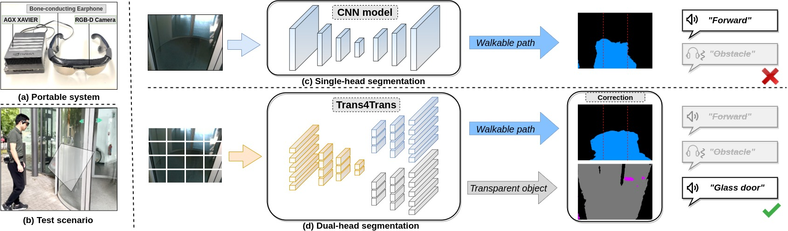

# Trans4Trans

[](https://paperswithcode.com/sota/semantic-segmentation-on-trans10k?p=trans4trans-efficient-transformer-for)

[](https://paperswithcode.com/sota/semantic-segmentation-on-dada-seg?p=trans4trans-efficient-transformer-for-1)

[](https://paperswithcode.com/sota/semantic-segmentation-on-eventscape?p=trans4trans-efficient-transformer-for)

[](https://paperswithcode.com/sota/semantic-segmentation-on-cityscapes-val?p=trans4trans-efficient-transformer-for-1)

## Introduction


We build upon a portable system based on the proposed Trans4Trans model, aiming to assist the people with visual impairment to correctly interact with general and transparent objects in daily living. 

Please refer to our conference paper.

**Trans4Trans: Efficient Transformer for Transparent Object Segmentation to Help Visually Impaired People Navigate in the Real World**, ICCVW 2021, [[paper](https://arxiv.org/pdf/2107.03172.pdf)].

For more details and the driving scene segmentation on benchmarks including Cityscapes, ACDC, and DADAseg, please refer to the journal version.

**Trans4Trans: Efficient Transformer for Transparent Object and Semantic Scene Segmentation in Real-World Navigation Assistance**, T-ITS 2021, [[paper](https://arxiv.org/pdf/2108.09174.pdf)].


## Installation

Create environment:

```bash
conda create -n trans4trans python=3.7
conda activate trans4trans
conda install pytorch==1.8.0 torchvision==0.9.0 torchaudio==0.8.0 cudatoolkit=11.1 -c pytorch -c conda-forge
conda install pyyaml pillow requests tqdm ipython scipy opencv-python thop tabulate
```

And install:

```bash
python setup.py develop --user
```

## Datasets
Create `datasets` directory and prepare [ACDC](https://acdc.vision.ee.ethz.ch/), [Cityscapes](https://www.cityscapes-dataset.com/), [DensePASS](https://github.com/chma1024/DensePASS#dataset), [Stanford2D3D](http://buildingparser.stanford.edu/dataset.html), and [Trans10K](https://github.com/xieenze/Trans2Seg#data-preparation) datasets as the structure below:

```text
./datasets
├── acdc 
│   ├── gt
│   └── rgb_anon
├── cityscapes
│   ├── gtFine
│   └── leftImg8bit
├── DensePASS
│   ├── gtFine
│   └── leftImg8bit
├── stanford2d3d
│   ├── area_1
│   ├── area_2
│   ├── area_3
│   ├── area_4
│   ├── area_5a
│   ├── area_5b
│   └── area_6
└── transparent/Trans10K_cls12
│   ├── test
│   ├── train
│   └── validation
```

Create `pretrained` direcotry and prepare [pretrained models](https://github.com/whai362/PVT#image-classification) as:

```text
.
├── pvt_medium.pth
├── pvt_small.pth
├── pvt_tiny.pth
└── v2
    ├── pvt_medium.pth
    ├── pvt_small.pth
    └── pvt_tiny.pth
```

## Training 

Before training, please modify the [config](./configs) file to match your own paths.

We train our models on 4 1080Ti GPUs, for example:

```bash
python -m torch.distributed.launch --nproc_per_node=4 tools/train.py --config-file configs/trans10kv2/pvt_tiny_FPT.yaml
```

We recommend to use the [mmsegmentation](https://github.com/open-mmlab/mmsegmentation) framework to train models with higher resolutions (e.g. 768x768).

## Evaluation

Before testing the model, please change the `TEST_MODEL_PATH` of the config file.

```bash
python -m torch.distributed.launch --nproc_per_node=4 tools/eval.py --config-file configs/trans10kv2/pvt_tiny_FPT.yaml
```
The weights can be downloaded from [BaiduDrive](https://pan.baidu.com/s/1N2VbNRwrqsQELMw7A6_xew?pwd=mq2v).


## Assistive system demo

We use Intel RealSense R200 camera on our assistive system. The librealsense are required.  
Please install the [**librealsense legacy**](https://github.com/IntelRealSense/librealsense/tree/legacy) version.
And install the dependencies for the demo:

```bash
pip install pyrealsense==2.2
pip install pyttsx3
pip install pydub
```

Download the pretrained weight from [GoogleDrive](https://drive.google.com/drive/folders/1_b1oSheDtniegqirWNPj7xb9VcaU-25r?usp=sharing) and save as `workdirs/cocostuff/model_cocostuff.pth` and `workdirs/trans10kv2/model_trans.pth`.

(Optional) Please check [`demo.py`](./demo.py) to customize the configurations, for example, the speech volumn and frequency.

After installation and weights downloaded, run `bash demo.sh`.


## References
* [Segmentron](https://github.com/LikeLy-Journey/SegmenTron)
* [Trans2Seg](https://github.com/xieenze/Trans2Seg)
* [mmsegmentation](https://github.com/open-mmlab/mmsegmentation)

## License

This repository is under the Apache-2.0 license. For commercial use, please contact with the authors.


## Citations

If you are interested in this work, please cite the following work:

```text
@inproceedings{zhang2021trans4trans,
  title={Trans4Trans: Efficient transformer for transparent object segmentation to help visually impaired people navigate in the real world},
  author={Zhang, Jiaming and Yang, Kailun and Constantinescu, Angela and Peng, Kunyu and M{\"u}ller, Karin and Stiefelhagen, Rainer},
  booktitle={Proceedings of the IEEE/CVF International Conference on Computer Vision},
  pages={1760--1770},
  year={2021}
}
```

```text  
@article{zhang2022trans4trans,
  title={Trans4Trans: Efficient transformer for transparent object and semantic scene segmentation in real-world navigation assistance},
  author={Zhang, Jiaming and Yang, Kailun and Constantinescu, Angela and Peng, Kunyu and M{\"u}ller, Karin and Stiefelhagen, Rainer},
  journal={IEEE Transactions on Intelligent Transportation Systems},
  year={2022},
  publisher={IEEE}
}
```